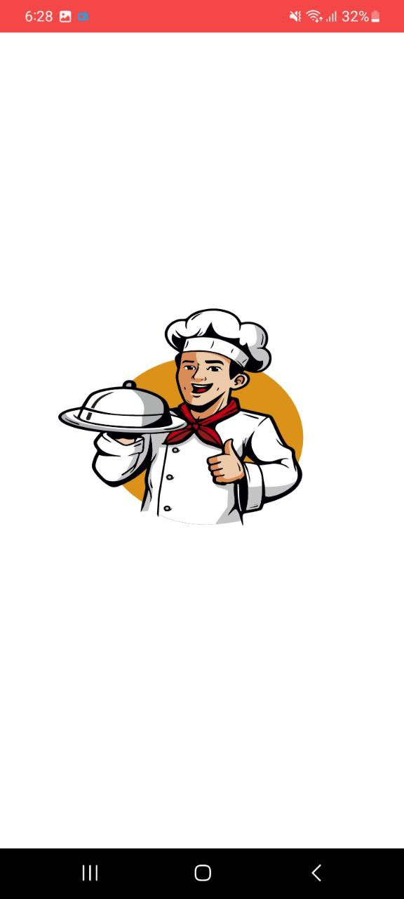
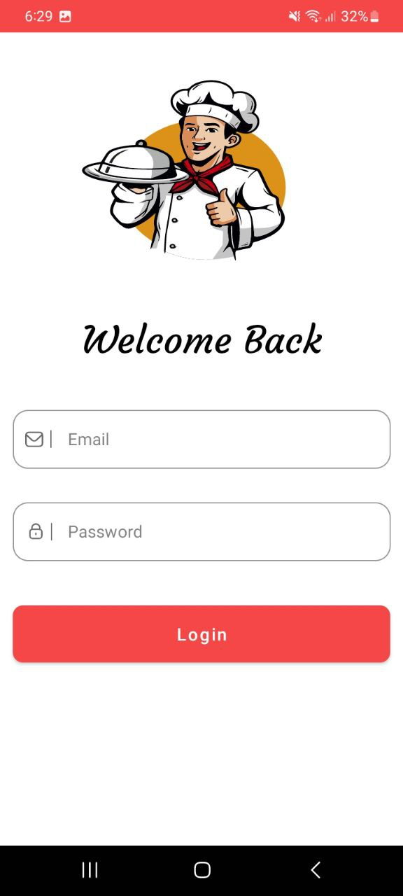
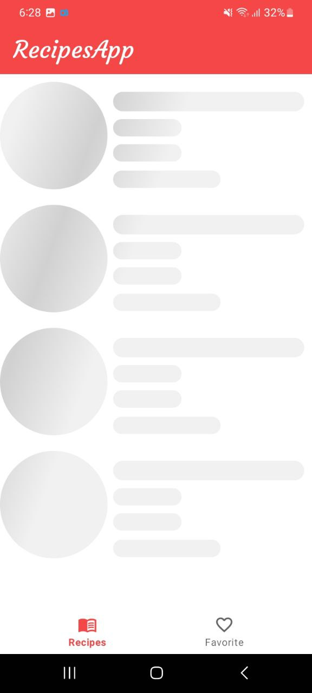
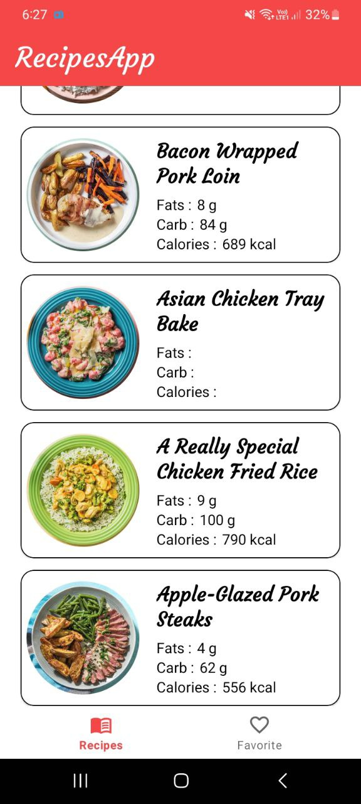
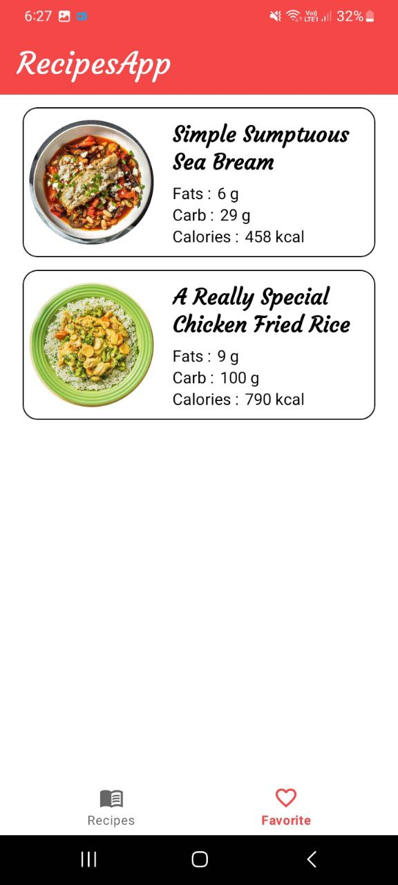
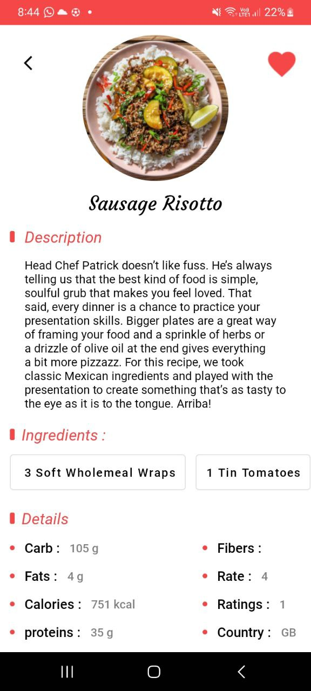

# Recipes-App

 
 

# Description
Simple recipes app that fetch recipes from recipes api and show them inside the app so that user will be able to choose a recipe and show it's details also user can add recipe to favorite or remove

# Features:
1- Show all recipes. 
2- Show details of a any specific recipe . 
3- Add recipe to favorite. 
4- Delete recipe from favorite. 

# Built with:
• Kotlin 
• MVVM Clean Architecture 
• Retrofit 
• Room Database 
• Hilt 
• Coroutines 
• Navigation Component 
• State Flow 
• Coil 
• Shimmer Effect 
• Shared Preference 
• Recycler View  
• Mockk 

# Screen Shots

